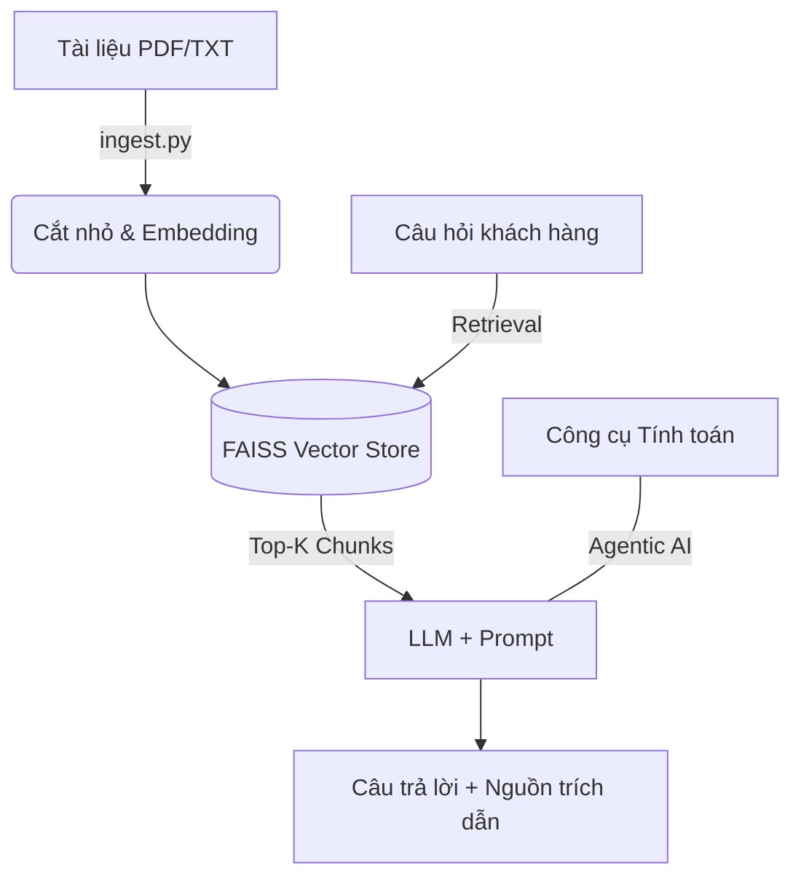

# 🏦 Bank RAG Assistant: Trợ lý AI Ngân hàng Tin cậy

Dự án xây dựng hệ thống hỏi đáp thông minh dựa trên tài liệu sản phẩm ngân hàng, sử dụng kỹ thuật **RAG (Retrieval-Augmented Generation)** kết hợp với **Agentic AI**. Hệ thống không chỉ trả lời chính xác mà còn trích dẫn nguồn cụ thể, giúp loại bỏ hiện tượng "ảo giác" (hallucination) của AI.

---

## 🌟 Kết quả Đánh giá Hiệu suất (RAGAs Metrics)

Dự án đã trải qua quá trình tối ưu hóa liên tục (4 vòng thử nghiệm) để đạt được sự cân bằng giữa khả năng tìm kiếm và chất lượng câu trả lời trên kho dữ liệu **20 file PDF nội bộ**.

| Chỉ số | Kết quả Đạt được | Ý nghĩa |
|---|---|---|
| **Context Recall** | **0.866** | Tìm thấy chính xác đoạn văn bản chứa đáp án trong 86.6% trường hợp. |
| **Faithfulness** | **0.661** | Câu trả lời trung thực, bám sát tài liệu nguồn, hạn chế tối đa việc bịa thông tin. |
| **Context Precision** | **0.573** | Khả năng lọc nhiễu tốt, ưu tiên các đoạn văn bản liên quan nhất từ kho dữ liệu lớn. |
| **Answer Relevancy** | **0.523** | Câu trả lời đi thẳng vào trọng tâm, giải quyết đúng vấn đề khách hàng yêu cầu. |

> **Nhận xét kỹ thuật:** Với kho dữ liệu lên tới 20 file PDF, mức Recall **0.866** khẳng định hệ thống truy hồi (Retrieval) hoạt động cực kỳ ổn định và chính xác.

---

## 🛠 Quá trình Tối ưu hóa (Optimization Journey)

Để đạt được kết quả trên, dự án đã thực hiện tinh chỉnh các tham số kỹ thuật dựa trên dữ liệu đánh giá thực tế:

- **Chiến lược Chunking:** Chuyển đổi từ chunk nhỏ sang `CHUNK_SIZE=900` kết hợp với `CHUNK_OVERLAP=150` để duy trì ngữ cảnh toàn vẹn cho các quy định ngân hàng phức tạp.
- **Cấu hình Truy hồi:** Tối ưu hóa `TOP_K=4` để cân bằng giữa việc lấy đủ thông tin và hạn chế nhiễu cho mô hình ngôn ngữ (LLM).
- **Prompt Engineering:** Siết chặt lời nhắc để ép mô hình bám sát 100% vào tài liệu được cung cấp.

---

## 🏗️ Kiến trúc Hệ thống



---

## 📁 Cấu trúc dự án

- **`data/`** — Kho tài liệu PDF/TXT nội bộ.
- **`ingest.py`** — Pipeline xử lý dữ liệu và xây dựng Vector Index.
- **`rag_chain.py`** — Logic cốt lõi của hệ thống RAG (Retrieval-QA).
- **`evaluation/`** — Module đánh giá hiệu suất sử dụng thư viện RAGAs.
- **`app.py`** — Giao diện Web tương tác trực quan qua Streamlit.
- **`agent.py`** — Phiên bản nâng cao, tích hợp công cụ tự động tính toán lãi suất/biểu phí.

---

## 🚀 Hướng dẫn Chạy ứng dụng

**1. Cài đặt thư viện:**
```bash
pip install -r requirements.txt
```

**2. Nạp kiến thức từ tài liệu:**
```bash
python ingest.py
```

**3. Khởi chạy Giao diện:**
```bash
streamlit run app.py
```

**4. Đánh giá hệ thống:**
```bash
python -m evaluation.evaluate
```

---

## 🧠 Công nghệ sử dụng

- **LangChain & RAGAs:** Framework phát triển và đánh giá RAG.
- **OpenAI / ShopAIKey Proxy:** Mô hình ngôn ngữ GPT-4o & Embedding v3.
- **FAISS:** Vector database cho phép tìm kiếm ngữ nghĩa tốc độ cao.
- **Streamlit:** Giao diện người dùng hiện đại và tiện lợi.

---

## 📈 Hướng phát triển tiếp theo

- Triển khai **Hybrid Search** (kết hợp Keyword và Vector Search) để tăng thêm 10-15% điểm Precision.
- Tích hợp **Reranking** để sắp xếp lại các đoạn văn bản quan trọng nhất trước khi đưa vào LLM.
- Mở rộng bộ tập câu hỏi mẫu (**Gold Set**) lên 50+ câu bao phủ toàn bộ kho tài liệu.
